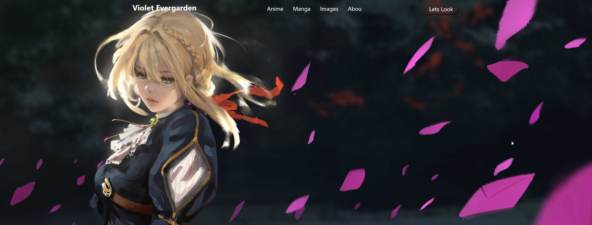
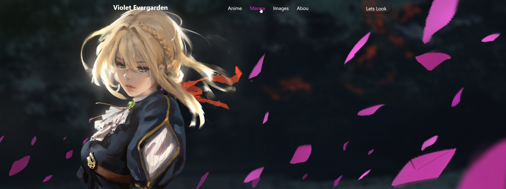
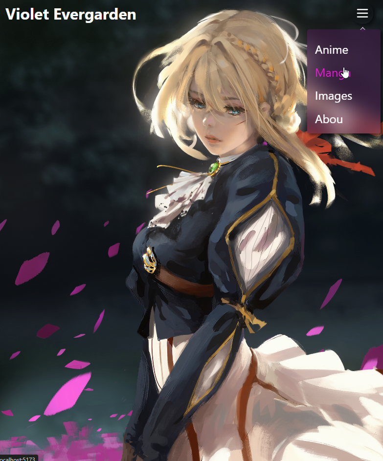

# React + Vite

# `git clone https://github.com/aftelnes/Adaptive-Navbar-Violet.git`

# `cd adaptive_navbar`

# `npm install`

# `npm run dev`

# Simple adaptive navbar

# skrinshot 1

# skrinshot 2

# skrinshot 3

# skrinshot 4

# skrinshot 5

# skrinshot 6

# video

./skrinhots/video.mp4
