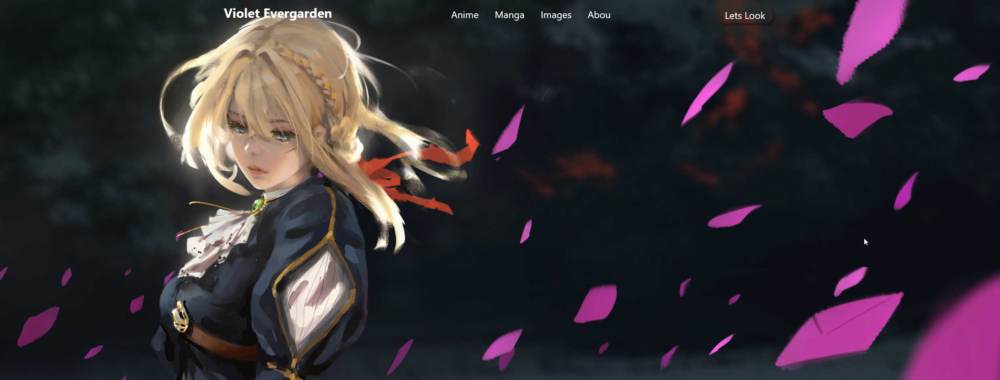
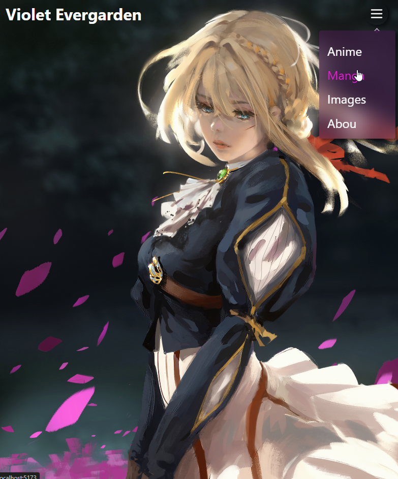

# React + Vite

# `git clone https://github.com/aftelnes/Adaptive-Navbar-Violet.git`

# `cd adaptive_navbar`

# `npm install`

# `npm run dev`

# Simple adaptive navbar

# screenshot 1

# screenshot 2

# screenshot 3

# screenshot 4

# screenshot 5

# screenshot 6

# video
